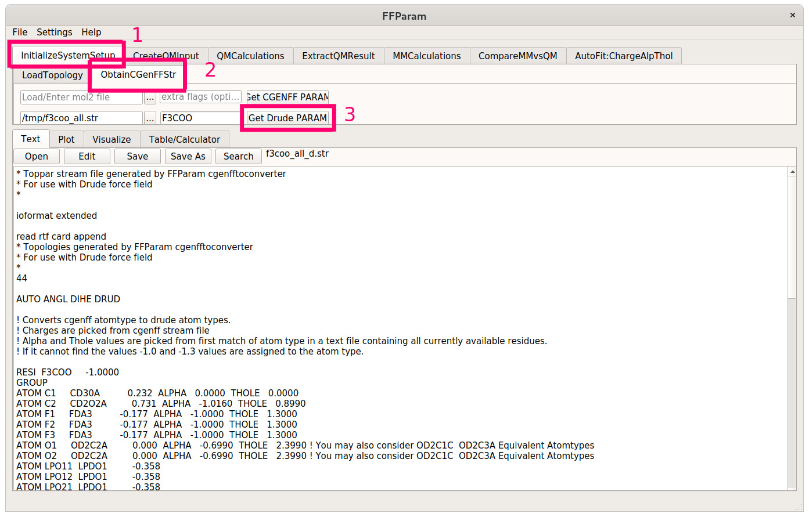
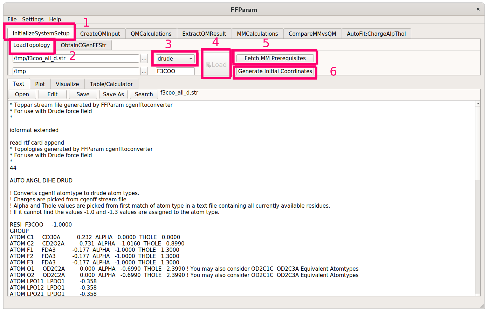
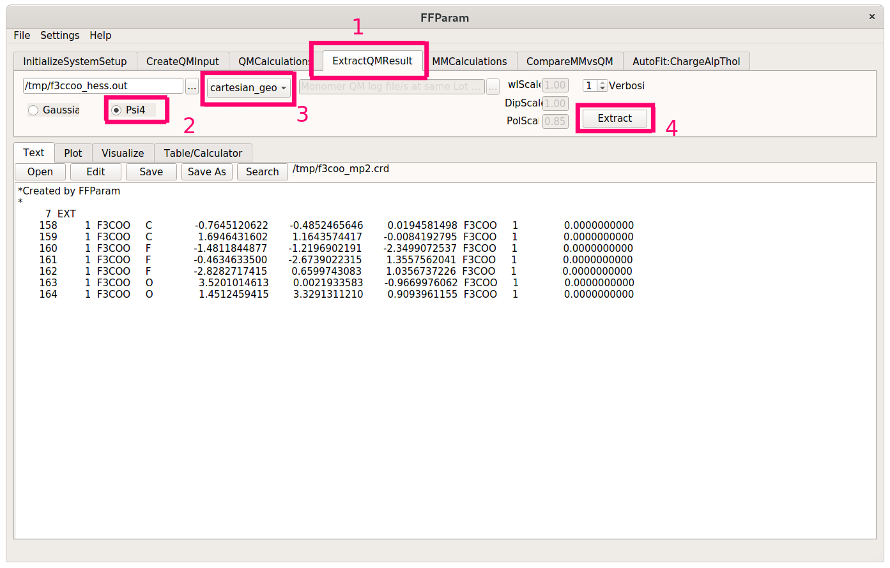

.. _force-field:

===============================
Generating Initial Force Fields
===============================

If you already have a working CHARMM-formatted force field that you want to
refine using **FFGenOpt**, then you can skip ahead to
:ref:`using FFGenOpt <ffgenopt>`. Otherwise follow along to see how the initial
parameters for F\ :sub:`3`\ CCOO\ :sup:`-` are generated.

Non-polarizable parameters
==========================

First, we will generate an initial guess using the `paramchem webserver \
<https://cgenff.umaryland.edu/>`_ and a .mol2 file.

.. note::
   Using paramchem requires a free-of-charge registration and has a limit of
   not more than 100 molecules per week.

For that, we will have to create a .mol2 file of trifluoroacetate. You can
either use Open Babel from the command line by typing

.. code-block:: bash

   obabel -ixyz f3ccoo.xyz -omol2 -Of3ccoo.mol2

or you can use avogadro to open the .xyz structure of your molecule and export
it as a .mol2 file. In either case, inspect the output of the conversion to
make sure that everything is sane (*e.g.* bond orders). Upload the structure
to `paramchem <https://cgenff.umaryland.edu/>`_ and make sure to check the
box `Include parameters that are already in CGenFF`. If everything went
smoothly, you should end up with a stream file that looks like this::

   * Toppar stream file generated by
   * CHARMM General Force Field (CGenFF) program version 2.5
   * For use with CGenFF version 4.6
   *
   
   read rtf card append
   * Topologies generated by
   * CHARMM General Force Field (CGenFF) program version 2.5
   *
   36 1
   
   ! "penalty" is the highest penalty score of the associated parameters.
   ! Penalties lower than 10 indicate the analogy is fair; penalties between 10
   ! and 50 mean some basic validation is recommended; penalties higher than
   ! 50 indicate poor analogy and mandate extensive validation/optimization.
   
   RESI F3COO         -1.000 ! param penalty=  10.200 ; charge penalty=  37.514
   GROUP            ! CHARGE   CH_PENALTY
   ATOM C1     CG302   0.232 !   35.711
   ATOM C2     CG2O3   0.731 !   37.514
   ATOM F1     FGA3   -0.177 !   14.418
   ATOM F2     FGA3   -0.177 !   14.418
   ATOM F3     FGA3   -0.177 !   14.418
   ATOM O1     OG2D2  -0.716 !    3.134
   ATOM O2     OG2D2  -0.716 !    3.134
   
   BOND C1   C2
   BOND C1   F1
   BOND C1   F2
   BOND C1   F3
   BOND C2   O1
   BOND C2   O2
   IMPR C2     O2     O1     C1
   
   END
   
   read param card flex append
   * Parameters generated by analogy by
   * CHARMM General Force Field (CGenFF) program version 2.5
   *
   
   ! Penalties lower than 10 indicate the analogy is fair; penalties between 10
   ! and 50 mean some basic validation is recommended; penalties higher than
   ! 50 indicate poor analogy and mandate extensive validation/optimization.
   
   BONDS
   CG2O3  CG302   160.95     1.4556 ! ***** , from CG2O3 CG322, PENALTY= 10
   CG2O3  OG2D2   525.00     1.2600 ! PROT adm jr. 7/23/91, acetic acid
   CG302  FGA3    265.00     1.3400 ! FLUROALK fluoroalkanes
   
   ANGLES
   CG302  CG2O3  OG2D2    30.98    104.01   49.99   2.43700 ! ***** , from CG322 CG2O3 OG2D2, PENALTY= 3.2
   OG2D2  CG2O3  OG2D2   100.00    128.00   70.00   2.25870 ! PROT adm jr. 7/23/91, correction, ACETATE (KK)
   CG2O3  CG302  FGA3     47.24    106.59   30.03   2.49990 ! ***** , from CG2O3 CG322 FGA1, PENALTY= 10.2
   FGA3   CG302  FGA3    118.00    107.00   30.00   2.15500 ! FLUROALK fluoroalkanes
   
   DIHEDRALS
   OG2D2  CG2O3  CG302  FGA3       0.8107  2   180.00 ! ***** , from OG2D2 CG2O3 CG322 FGA1, PENALTY= 10.2
   
   IMPROPERS
   CG2O3  OG2D2  OG2D2  CG302     96.0000  0     0.00 ! ***** , from CG2O3 OG2D2 OG2D2 CG322, PENALTY= 1
   
   END
   RETURN

This serves as the basis for our polarizable force field. You can either
convert to polarizable atom types by analogy or use an automated tool. The
`ffparam <http://ffparam.umaryland.edu/download.php>`_ utility provides a GUI
and a documentation detailing how to validate parameters with a high penalty.

.. tip::
   Since **ffparam** can be picky about the different software versions it needs
   (e.g. not working with python 3.8 or higher), you could use the following
   .yml file to build a conda env.

Modify the path in the last line of this file to point to your conda install::

   name: ffpenv
   channels:
     - anaconda
     - conda-forge
     - defaults
   dependencies:
     - _libgcc_mutex=0.1=conda_forge
     - _openmp_mutex=4.5=1_gnu
     - alsa-lib=1.2.3=h516909a_0
     - bcrypt=3.2.0=py37h7b6447c_0
     - boost=1.70.0=py37h9de70de_1
     - boost-cpp=1.70.0=ha2d47e9_1
     - bzip2=1.0.8=h7f98852_4
     - ca-certificates=2023.5.7=hbcca054_0
     - cairo=1.16.0=hb05425b_3
     - certifi=2023.5.7=pyhd8ed1ab_0
     - cffi=1.15.1=py37h43b0acd_1
     - cryptography=38.0.2=py37h5994e8b_1
     - cudatoolkit=11.8.0=h37601d7_11
     - cycler=0.10.0=py_2
     - dbus=1.13.6=h48d8840_2
     - expat=2.4.1=h9c3ff4c_0
     - fftw=3.3.10=nompi_hf0379b8_106
     - fontconfig=2.14.1=hef1e5e3_0
     - freeglut=3.2.1=h9c3ff4c_2
     - freetype=2.10.4=h0708190_1
     - gettext=0.21.1=h27087fc_0
     - glib=2.76.2=hfc55251_0
     - glib-tools=2.76.2=hfc55251_0
     - greenlet=1.1.1=py37hcd2ae1e_0
     - gst-plugins-base=1.14.1=h6a678d5_1
     - gstreamer=1.14.1=h5eee18b_1
     - icu=58.2=hf484d3e_1000
     - importlib-metadata=4.8.1=py37h89c1867_0
     - jbig=2.1=h7f98852_2003
     - jpeg=9d=h36c2ea0_0
     - keyutils=1.6.1=h166bdaf_0
     - kiwisolver=1.3.2=py37h2527ec5_0
     - krb5=1.20.1=h81ceb04_0
     - lcms2=2.12=hddcbb42_0
     - ld_impl_linux-64=2.36.1=hea4e1c9_2
     - lerc=2.2.1=h9c3ff4c_0
     - libblas=3.9.0=11_linux64_openblas
     - libcblas=3.9.0=11_linux64_openblas
     - libclang=11.1.0=default_ha53f305_1
     - libdeflate=1.7=h7f98852_5
     - libedit=3.1.20191231=he28a2e2_2
     - libevent=2.1.12=h3358134_0
     - libffi=3.4.2=h7f98852_5
     - libgcc-ng=12.2.0=h65d4601_19
     - libgfortran-ng=11.1.0=h69a702a_8
     - libgfortran5=11.1.0=h6c583b3_8
     - libglib=2.76.2=hebfc3b9_0
     - libgomp=12.2.0=h65d4601_19
     - libiconv=1.17=h166bdaf_0
     - liblapack=3.9.0=11_linux64_openblas
     - libllvm11=11.1.0=hf817b99_2
     - libnsl=2.0.0=h7f98852_0
     - libogg=1.3.4=h7f98852_1
     - libopenblas=0.3.17=pthreads_h8fe5266_1
     - libopus=1.3.1=h7f98852_1
     - libpng=1.6.37=h21135ba_2
     - libpq=15.2=hb675445_0
     - libsodium=1.0.18=h7b6447c_0
     - libstdcxx-ng=12.2.0=h46fd767_19
     - libtiff=4.3.0=hf544144_1
     - libuuid=2.32.1=h7f98852_1000
     - libvorbis=1.3.7=h9c3ff4c_0
     - libwebp-base=1.2.1=h7f98852_0
     - libxcb=1.15=h0b41bf4_0
     - libxkbcommon=1.0.3=he3ba5ed_0
     - libxml2=2.9.14=h74e7548_0
     - libxslt=1.1.32=hae48121_1003
     - libzlib=1.2.13=h166bdaf_4
     - lz4-c=1.9.3=h9c3ff4c_1
     - matplotlib-base=3.4.3=py37h1058ff1_0
     - mysql-common=8.0.32=hf1915f5_2
     - mysql-libs=8.0.32=hca2cd23_2
     - ncurses=6.2=h58526e2_4
     - nspr=4.30=h9c3ff4c_0
     - nss=3.69=hb5efdd6_0
     - numpy=1.21.2=py37h31617e3_0
     - ocl-icd=2.3.1=h7f98852_0
     - ocl-icd-system=1.0.0=1
     - olefile=0.46=pyh9f0ad1d_1
     - openjpeg=2.4.0=hb52868f_1
     - openmm=7.5.1=py37h96c4ddf_1
     - openssl=3.1.0=hd590300_3
     - pandas=1.3.2=py37he8f5f7f_0
     - paramiko=2.7.2=py_0
     - pcre=8.45=h9c3ff4c_0
     - pcre2=10.40=hc3806b6_0
     - pillow=8.0.0=py37h9a89aac_0
     - pip=21.2.4=pyhd8ed1ab_0
     - pixman=0.40.0=h36c2ea0_0
     - pthread-stubs=0.4=h36c2ea0_1001
     - pycairo=1.20.1=py37hfff247e_0
     - pycparser=2.20=py_2
     - pynacl=1.4.0=py37h7b6447c_1
     - pyparsing=2.4.7=pyh9f0ad1d_0
     - python=3.7.12=hf930737_100_cpython
     - python-dateutil=2.8.2=pyhd8ed1ab_0
     - python_abi=3.7=2_cp37m
     - pytz=2021.1=pyhd8ed1ab_0
     - qt=5.6.3=h8bf5577_3
     - rdkit=2019.09.3=py37hb31dc5d_0
     - readline=8.1=h46c0cb4_0
     - reportlab=3.5.68=py37h69800bb_0
     - setuptools=57.4.0=py37h89c1867_0
     - six=1.16.0=pyh6c4a22f_0
     - sqlalchemy=1.4.23=py37h5e8e339_0
     - sqlite=3.36.0=h9cd32fc_0
     - tk=8.6.11=h27826a3_1
     - tornado=6.1=py37h5e8e339_1
     - typing_extensions=3.10.0.0=pyha770c72_0
     - wheel=0.37.0=pyhd8ed1ab_1
     - xorg-fixesproto=5.0=h7f98852_1002
     - xorg-inputproto=2.3.2=h7f98852_1002
     - xorg-kbproto=1.0.7=h7f98852_1002
     - xorg-libice=1.0.10=h7f98852_0
     - xorg-libsm=1.2.3=hd9c2040_1000
     - xorg-libx11=1.7.2=h7f98852_0
     - xorg-libxau=1.0.9=h7f98852_0
     - xorg-libxdmcp=1.1.3=h7f98852_0
     - xorg-libxext=1.3.4=h7f98852_1
     - xorg-libxfixes=5.0.3=h7f98852_1004
     - xorg-libxi=1.7.10=h7f98852_0
     - xorg-libxrender=0.9.10=h7f98852_1003
     - xorg-renderproto=0.11.1=h7f98852_1002
     - xorg-xextproto=7.3.0=h7f98852_1002
     - xorg-xproto=7.0.31=h7f98852_1007
     - xz=5.2.5=h516909a_1
     - zipp=3.5.0=pyhd8ed1ab_0
     - zlib=1.2.13=h166bdaf_4
     - zstd=1.5.2=h3eb15da_6
     - pip:
         - ffparam==1.0.0
         - pyopengl==3.1.5
         - pyside2==5.15.2
         - shiboken2==5.15.2
   prefix: /path/to/your/conda/envs/ffpenv

Then create a new environment via

.. code-block:: bash

   conda env create -f ffepnv.yml

After that, build and install **ffparam** from source and finally install
pyside2 manually in the new conda env by running

.. code-block:: bash

   conda install -n ffpenv -c conda-forge pyside2

Activate the new conda environment - 
if everything went smoothly, the ``ffparam-gui`` command should present you
with a window and you'll be ready to start parametrizing.

Polarizable parameters
======================

We could go ahead and reassign partial charges, but the focus of this exercise
is the tuning of bonded parameters. For this reason, we will simply use these
values and convert them via **ffparam**.

The final stream file then has the
following lines::

   * Toppar stream file generated by FFParam cgenfftoconverter
   * For use with Drude force field
   *
   
   ioformat extended
   
   read rtf card append
   * Topologies generated by FFParam cgenfftoconverter
   * For use with Drude force field
   *
   44
   
   AUTO ANGL DIHE DRUD
   
   ! Converts cgenff atomtype to drude atom types.
   ! Charges are picked from cgenff stream file
   ! Alpha and Thole values are picked from first match of atom type in a text file containing all currently available residues.
   ! If it cannot find the values -1.0 and -1.3 values are assigned to the atom type.
   
   RESI  F3COO     -1.0000
   GROUP
   ATOM C1     CD30A          0.232  ALPHA   0.0000  THOLE   0.0000
   ATOM C2     CD2O2A         0.731  ALPHA   -1.0160  THOLE   0.8990
   ATOM F1     FDA3          -0.177  ALPHA   -1.0000  THOLE   1.3000
   ATOM F2     FDA3          -0.177  ALPHA   -1.0000  THOLE   1.3000
   ATOM F3     FDA3          -0.177  ALPHA   -1.0000  THOLE   1.3000
   ATOM O1     OD2C2A         0.000  ALPHA   -0.6990  THOLE   2.3990 ! You may also consider OD2C1C  OD2C3A Equivalent Atomtypes
   ATOM O2     OD2C2A         0.000  ALPHA   -0.6990  THOLE   2.3990 ! You may also consider OD2C1C  OD2C3A Equivalent Atomtypes
   ATOM LPO11  LPDO1         -0.358
   ATOM LPO12  LPDO1         -0.358
   ATOM LPO21  LPDO1         -0.358
   ATOM LPO22  LPDO1         -0.358
   
   BOND C1  C2 
   BOND C1  F1 
   BOND C1  F2 
   BOND C1  F3 
   BOND C2  O1 
   BOND C2  O2 
   BOND  LPO11  O1 
   BOND  LPO12  O1 
   BOND  LPO21  O2 
   BOND  LPO22  O2 
   
   LONE RELATIVE LPO11  O1  C2  C1 DIST 0.3500 ANGLE  110.00 DIHE    0.00
   LONE RELATIVE LPO12  O1  C2  C1 DIST 0.3500 ANGLE  110.00 DIHE  180.00
   LONE RELATIVE LPO21  O2  C2  C1 DIST 0.3500 ANGLE  110.00 DIHE    0.00
   LONE RELATIVE LPO22  O2  C2  C1 DIST 0.3500 ANGLE  110.00 DIHE  180.00
   END
   
   
   read param card append
   * Parameters generated by FFParam cgenfftoconverter
   * For use with Drude force field
   *
   
   ! Parameters are picked from same text file containing all currently available parameters.
   ! Similar approach like cgenff is applied, but it is not checked for its robustness.
   
   BONDS
   CD30A   CD2O2A   410.000  1.360   ! from CD2R5A CD2R5A  PENALTY 14.000
   CD30A   FDA3   200.000  1.810   ! from CD32A SD2C2B  PENALTY 25.000
   
   ANGLES
   CD2O2A   CD30A   FDA3   43.000  113.200   ! from CD32A CD32A SD31B  PENALTY 44.000
   FDA3   CD30A   FDA3   45.000  116.500   ! from OD305A CD30FA OD31E  PENALTY 157.000
   CD30A   CD2O2A   OD2C2A   40.000  109.300   ! from CD31A CD2O2A OD2C2A  PENALTY  2.000
   
   DIHEDRALS
   FDA3   CD30A   CD2O2A   OD2C2A   0.438  1  180.000   ! from OD31A CD32A CD30FA OD31E  PENALTY 121.000
   FDA3   CD30A   CD2O2A   OD2C2A   0.587  2  180.000   ! from OD31A CD32A CD30FA OD31E  PENALTY 121.000
   FDA3   CD30A   CD2O2A   OD2C2A   0.382  3  180.000   ! from OD31A CD32A CD30FA OD31E  PENALTY 121.000
   FDA3   CD30A   CD2O2A   OD2C2A   0.127  6  180.000   ! from OD31A CD32A CD30FA OD31E  PENALTY 121.000
   
   IMPROPERS
   
   
   END
   RETURN

If you have access to **CHARMM**, then you have everything you need to generate
a .psf file and coordinates for F\ :sub:`3`\ CCOO\ :sup:`-`.
You can skip ahead to using **FFGenOpt**.
If that is not the case, then we will have to jump through some additional hoops
to create these files.

First, load the topology of the molecule from the newly generated polarizable
stream file. Then hit the *Fetch MM Prerequisites* and the
*Generate Initial Coordinates* buttons.

Extract the optimized geometry of trifluoroacetate from the Psi4 output
using the *ExtractQMResult* tab. Make sure to check Psi4 and specify
*cartesian_geom* in the dropdown menu. This will create a **CHARMM**-formatted
coordinate file where atom names may or may not be correct.

Next, switch to the *MMCalculations* tab and specify the necessary stream / 
input files (consult the
`documentation <http://ffparam.umaryland.edu/manual/workflow.html/>`_ if
you are stuck) for an MM job. Choose *cartesian_geom* from the dropdown menu
again and check *Minimize*. Set OpenMM as the MD enginge on the right side of
the window and hit *Run MM*.

.. image:: ../assets/images/ffp4_hints.png

You should do this for both the polarizable and the
non-polarizable stream files. If you see error messages, don't panic - we only
need the .psf files created by **ffparam**, not the actual results of the
minimization.

.. tip::
   For some atom types, the conversion to polarizable Drude-types doesn't
   always work perfectly out-of-the-box. If parameters, residues or atom types
   are missing, download the latest version of the DGenFF stream files from the
   homepage of the
   `MacKerell group <http://mackerell.umaryland.edu/charmm_drude_ff.shtml>`_ and
   specify these as the master *toppar* files.

If you have the intial coordinates for the non-polarizable and the optimized
coordinates for the polarizable stream files, then you can go ahead and start
using FFGenOpt.
