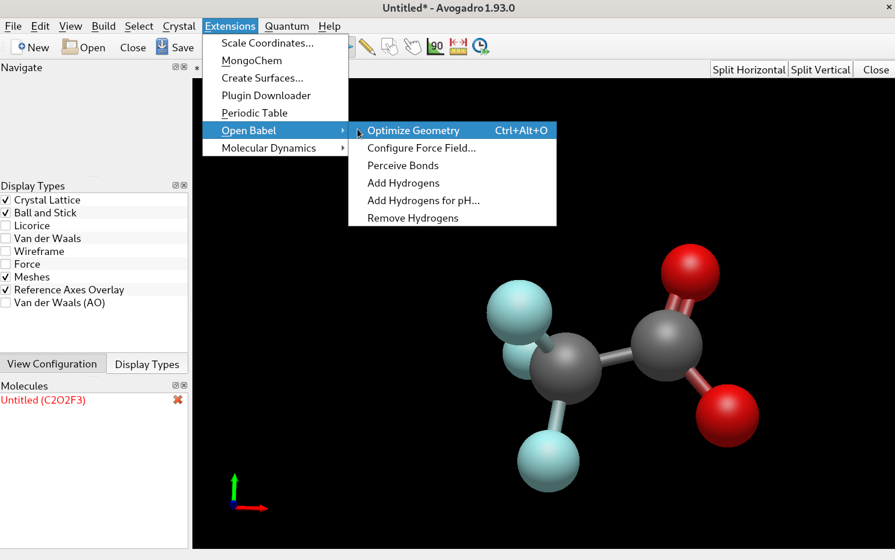

.. _Quantum-Mechanics-Setup:

=======================
Quantum Mechanics Setup
=======================

Initial Coordinates
===================

Our goal is to generate parameters for the trifluoroacetate ion,
F\ :sub:`3`\ CCOO\ :sup:`-`\ .
To do this, we will first generate our intial coordinates used in the QM
calulations by drawing our molecule in avogadro and optimizing its structure
via Open Babel.

On debian-based systems, you can install avogadro by

.. code-block:: bash
   
   sudo apt-get install avogadro

After opening avogadro, you can start building your molecule by clicking on
the black field. Use the keyboard or the builder menu to construct
trifluoroacetate.

.. tip::
   Clicking on an existing bond increases the bond order, right-clicking on an
   atom deletes it.

You can then use the Open Babel extension to get a reasonable starting
geometry.

If the option is greyed out, you can install Open Babel *e.g.* in a conda
environment. If you don't already have it, you can grab the latest version of
`Miniconda \
<https://repo.anaconda.com/miniconda/Miniconda3-latest-Linux-x86_64.sh>`_.
Execute the script to install Miniconda, and then create a new environment
by typing

.. code-block:: bash

   conda create -n ffgenopt python=3.9

Answer yes to the prompt and activate new environment. You can then install
Open Babel and open avogadro again.

.. code-block:: bash

   conda activate ffgenopt
   conda install -c conda-forge openbabel

Now you should be able to use the extension in avogadro, provided you started
it with the ffgenopt environment active. Save the resulting geometry
(File -> Export -> Molecule) as an .xyz file.

QM Calculation
==============

Now you can start a QM calculation with your software of choice (such as Psi4
or Gaussian). If you want to use Psi4, you can install it in your ffgenopt
environment via

.. code-block:: bash

   conda install -n ffgenopt -c psi4 psi4

Your QM job script may look something like this:

.. code-block:: python

   import psi4,os,importlib
   import numpy as np
  
   mem_bytes = os.sysconf('SC_PAGE_SIZE') * os.sysconf('SC_PHYS_PAGES')
   mem_gib = 0.75*mem_bytes/(1024.**3)
   mem= str(mem_gib)+'gb'
   cpu=os.cpu_count()
   
   psi4.set_num_threads(cpu)
   psi4.set_memory(mem)
   
   outfile = 'f3ccoo_hess.out'
   psi4.core.set_output_file(outfile, False)
   psi4.core.IOManager.shared_object().set_default_path('/tmp/')
   
   inp_mol = psi4.geometry("""
   -1 1
   C     -1.60392   -0.46377    0.02162
   C     -0.36006    0.41501    0.05794
   F     -1.97453   -0.73962   -1.24327
   F     -1.40553   -1.63727    0.65260
   F     -2.65285    0.13123    0.62146
   O      0.71408   -0.17910   -0.39895
   O     -0.37609    1.60231    0.32048
   """)
   
   mp2_e, mp2_wfn = psi4.optimize('mp2/cc-pvdz', molecule=inp_mol, return_wfn = True)
   hess, wfn = psi4.driver.hessian('mp2/cc-pvdz', return_wfn = True)
   dipder = wfn.variables().get("CURRENT DIPOLE GRADIENT", None)
   if dipder is not None:
       dipder = np.asarray(dipder).T
   hess_arr = np.asarray(hess)
   geom = np.asarray(inp_mol.geometry())
   masses = np.asarray([inp_mol.mass(i) for i in range(inp_mol.natom())])
   ir_labels = inp_mol.irrep_labels()
   basis = wfn.basisset()
   
   vibinfo, vibtext = psi4.driver.qcdb.vib.harmonic_analysis(hess_arr, geom, 
   masses, basis, ir_labels, dipder)
   symbols = [inp_mol.symbol(at) for at in range(inp_mol.natom())]
   
   with open(outfile, 'a') as f:
       print(psi4.driver.qcdb.vib.print_vibs(vibinfo, normco='q', ncprec=5), file=f)
   
   with open("f3ccoo.molden", 'w') as handle:
       handle.write(psi4.driver.qcdb.vib.print_molden_vibs(vibinfo, symbols, geom,
       standalone=True))

This file requests a geometry optimization and subsequent frequency calculation
at the mp2/cc-pvdz level of theory, printing the normal modes at the end of the
output file, as well as writing them in a molden format for visualization.
The ``inp_mol`` block contains the charge, electronic multiplicity as well as
the starting geometry of your molecule, in this case taken from the avogadro
output.
You may want to change the value of ``set_default_path()`` (*i.e.* the
directory where the temporary files are written), since ``tmp`` is often
limited in size.

Save the resulting file using a descriptive name, for instance ``f3ccoo.py``.
If your conda env is activated, you can start calculating the optimized
geometry and the frequencies via

.. code-block:: bash

   python3 f3ccoo.py

Once the calculation finishes, inspect the resulting frequencies in the output
file and make sure none of them are imaginary. If that is the case, then
you can proceed to the :ref:`next part <force-field>` to generate the initial
set of parameters. Alternatively, you can skip ahead to
:ref:`using FFGenOpt <ffgenopt>`.
If you do see imaginary frequencies, you can inspect the normal modes
corresponding to those numers with molden. To install molden on debian-based
systems use the commands

.. code-block:: bash

   sudo apt-get install snapd
   sudo snap install core
   sudo snap install molden

Now you can open the molden-formatted normal mode file by

.. code-block:: bash

   molden f3ccoo.molden

Extract the final geometry from the QM output into an .xyz file and open it
with avogadro. Using the bond-centric atom manipulation tool, change the value
of the internal coordinate (*e.g.* the **F-C-C-O** dihedral) slightly and
start a geometry optimization with these coordinates. Rinse and repeat until
only positive frequencies are reported in the output.
